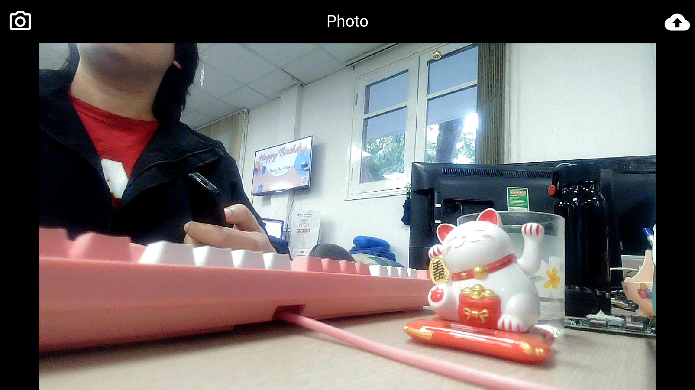
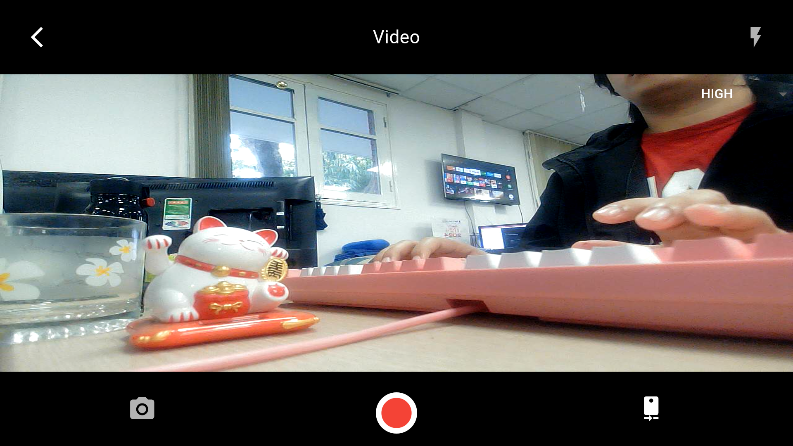
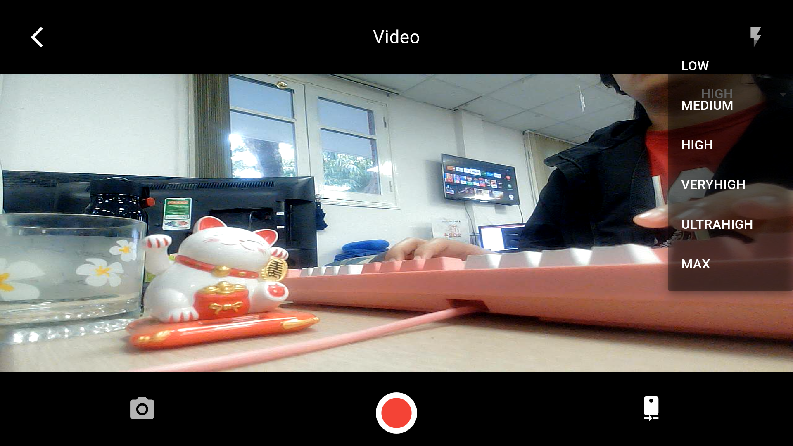
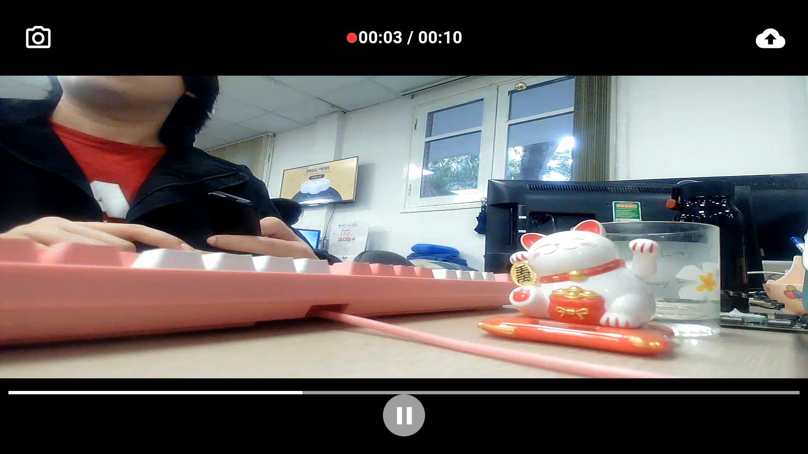
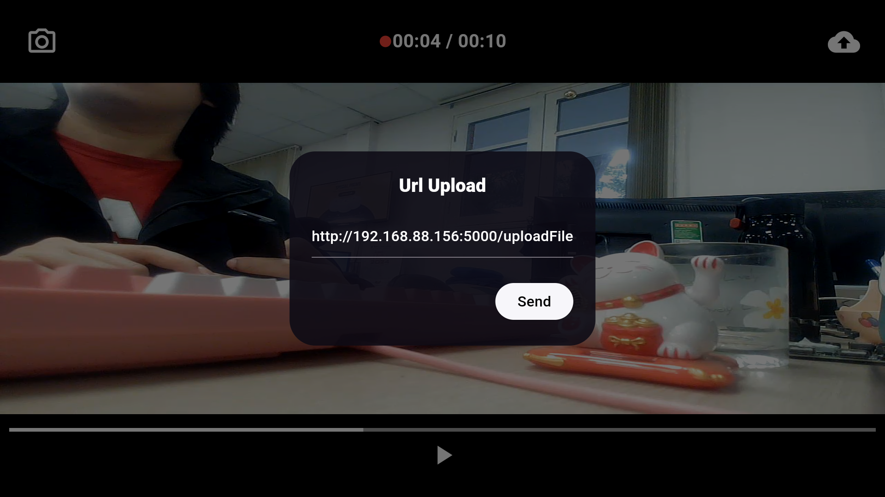

# 📸 Recording Webcam - Camera App for Android TV, Android Phone

This is a **Recording Webcam** app project developed during a technical internship at **VNPT Technology** by Nguyen Thanh Chung, a student of the School of Electrical and Electronic Engineering at **Hanoi University of Science and Technology**. The app is designed for Android TV and Android phones, allowing users to capture and record videos, and upload files to a server.

Show some ❤️ and star ⭐ the repo if you like the project.

###### Contact for work, email: [chunhthanhde.dev@gmail.com](mailto:chunhthanhde.dev@gmail.com)

## 📱 Features

The **Recording Webcam** app provides multiple functionalities to enhance the camera experience on Android devices.

| Function    | Description                                                                                                                           |
|-------------|---------------------------------------------------------------------------------------------------------------------------------------|
| `Capture`   | Take photos with an available camera, switch between front and back cameras, control the flash, and adjust photo quality.              |
| `Recording` | Record videos, switch cameras, control the flash, and adjust the video quality during recording.                                       |
| `Upload`    | Upload captured photos or recorded videos to a server via a configurable URL.                                                          |

## 📸 Screenshots

Explore different screens available in the app:

| Screen                | Screenshot                                                              |
|-----------------------|-------------------------------------------------------------------------|
| `Capture Screen`       |       |
| `View Image Screen`    |       |
| `Recording Screen`     |      |
| `Change Resolution`    |  |
| `View Video Screen`    |       |
| `Upload to Server`     |      |

## 🌟 Star History

<a href="https://star-history.com/#TV-Box-Support/Recording-Webcam/&Date">
 <picture>
   <source media="(prefers-color-scheme: dark)" srcset="https://api.star-history.com/svg?repos=TV-Box-Support/Recording-Webcam/&type=Date&theme=dark" />
   <source media="(prefers-color-scheme: light)" srcset="https://api.star-history.com/svg?repos=TV-Box-Support/Recording-Webcam/&type=Date" />
   
 </picture>
</a>
